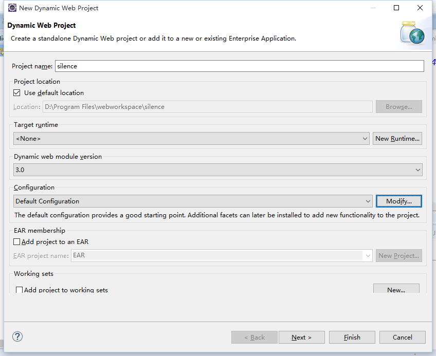
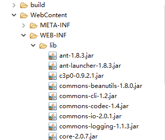
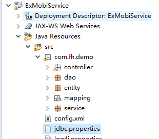
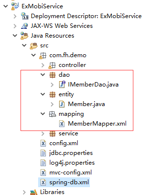
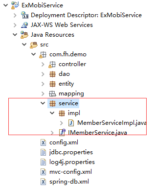
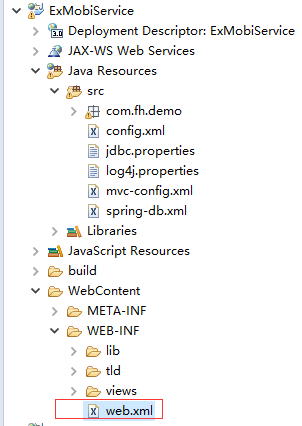
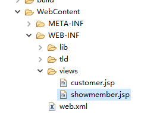
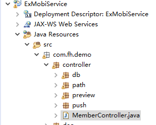

<h1>SSM框架整合搭建</h1>  

----------
Spring+SpringMVC+Mybatis是目前最流行的java web框架组合，简单的来说SpringMVC负责处理客户端和web的请求，然后给客户端返回数据， Spring则是负责管理事务对象，也就是作为不同层面的衔接，而MyBatis是个持久层框架，通过MyBatis开发者可以以对象的方式操作业务系统数据库。

## 准备工作
准备SSM框架所依赖的jar包

* Spring相关jar包：

spring-aop-4.3.1.RELEASE.jar

spring-beans-4.3.1.RELEASE.jar

spring-context-4.3.1.RELEASE.jar

spring-context-support-4.3.1.RELEASE.jar

spring-core-4.3.1.RELEASE.jar

spring-expression-4.3.1.RELEASE.jar

spring-jdbc-4.3.1.RELEASE.jar

spring-test-4.3.1.RELEASE.jar

spring-tx-4.3.1.RELEASE.jar

spring-web-4.3.1.RELEASE.jar

spring-webmvc-4.3.1.RELEASE.jar

* MyBatis相关jar包：

mybatis-3.3.0.jar

mybatis-spring-1.2.2.jar

* 数据库驱动jar包(根据具体数据库选择)：

mysql-connecter-java-5.1.39.jar/postgresql-9.1-901.jdbc4.jar

* 日志相关jar包：

log4j-1.2.16.jar

slf4j-log4j12-1.6.2.jar

slf4j-api-1.6.2.jar

* 映射json：

jackson-mapper-asl-1.9.13.jar

* 编码相关jar包:

commons-codec-1.4.jar

* IO处理相关jar包：

commons-io-2.0.1.jar

## IDE及JDK要求

使用eclipse、MyEclipse、IntelliJ IDEA均可；本教程使用的IDE为eclipse JAVA EE 4.6.0；

JDK版本要求1.7（不得使用1.8）。

## 搭建整合

### 第一步，新建Web工程

使用Eclipse新建“Dynamic Web Projcet”：


在弹出的窗口中填写项目名称，然后点击“Next”：



继续点击“Next”：


在这一步的窗口，勾选“Generate web.xml deployment descriptor”，然后点击Finish就创建完成啦


### 第二步：引入准备好的jar包
在WebContent/WEB-INF/lib目录下，把之前准备好的jar包都引入进来：



### 第三步：配置jdbc.properties文件
在src根目录下建立“jdbc. properties”配置文件，此文件用来配置工程要连接的数据库基本信息参数


内容示例：

```javascript
driver=org.postgresql.Driver
url=jdbc:postgresql://192.168.160.167:5432/addrlist
username=addrlist
password=FHuma025
#定义初始连接数  
initialSize=1
#定义最大连接数  
maxActive=20
#定义最大空闲  
maxIdle=20
#定义最小空闲  
minIdle=1
#定义最长等待时间  
maxWait=60000
```

### 第四步，配置spring-db.xml文件
在src目录下建立spring-db.xml文件，此文件用来完成Spring和Mybatis的整合。主要的就是自动扫描，自动注入，配置数据库。
```xml
<?xml version="1.0" encoding="UTF-8"?>
<beans xmlns="http://www.springframework.org/schema/beans"
	xmlns:xsi="http://www.w3.org/2001/XMLSchema-instance" xmlns:mvc="http://www.springframework.org/schema/mvc"
	xmlns:context="http://www.springframework.org/schema/context"
	xsi:schemaLocation="http://www.springframework.org/schema/mvc http://www.springframework.org/schema/mvc/spring-mvc.xsd
		http://www.springframework.org/schema/beans http://www.springframework.org/schema/beans/spring-beans.xsd
		http://www.springframework.org/schema/context http://www.springframework.org/schema/context/spring-context.xsd">
<!-- 引入jdbc配置文件 -->
<bean id="propertyConfigurer"
	class="org.springframework.beans.factory.config.PropertyPlaceholderConfigurer">
	<property name="location" value="classpath:jdbc.properties" />
</bean>

<!-- spring和MyBatis完美整合，不需要mybatis的配置映射文件 -->  
<bean id="sqlSessionFactory" class="org.mybatis.spring.SqlSessionFactoryBean">  
    <property name="dataSource" ref="dataSource" />  
    <!-- 自动扫描mapping.xml文件 -->  
    <property name="mapperLocations" value="classpath:com/fh/demo/mapping/*.xml"></property>  
</bean>  

<!-- DAO接口所在包名，Spring会自动查找其下的类 -->  
 <bean class="org.mybatis.spring.mapper.MapperScannerConfigurer">  
     <property name="basePackage" value="com.fh.demo.dao" />  
     <property name="sqlSessionFactoryBeanName" value="sqlSessionFactory"></property>  
 </bean>  

 <!-- (事务管理)transaction manager, use JtaTransactionManager for global tx -->  
 <bean id="transactionManager"  
     class="org.springframework.jdbc.datasource.DataSourceTransactionManager">  
     <property name="dataSource" ref="dataSource" />  
 </bean>  

<!-- 配置DataSource数据源 -->
<bean id="dataSource" class="com.mchange.v2.c3p0.ComboPooledDataSource">
	<property name="driverClass" value="${driver}" />
	<property name="jdbcUrl" value="${url}" />
	<property name="user" value="${username}" />
	<property name="password" value="${password}" />
	<property name="minPoolSize" value="2" />
	<property name="maxPoolSize" value="20" />
	<property name="initialPoolSize" value="2" />
	<property name="preferredTestQuery">
		<value>select 1</value>
	</property>
	<property name="checkoutTimeout">
		<value>3000</value>
	</property>
	<property name="idleConnectionTestPeriod">
		<value>60</value>
	</property>
	<property name="maxIdleTime">
		<value>120</value>
	</property>
	<property name="dataSourceName">
		<value>addrlist</value>
	</property>
</bean>
</beans>  

```

### 第五步，配置Log4j文件

为了方便调试，一般都会使用日志来输出信息，Log4j是Apache的一个开放源代码项目，通过使用Log4j，我们可以控制日志信息输送的目的地是控制台、文件、GUI组件，甚至是套接口服务器、NT的事件记录器、UNIX Syslog守护进程等；我们也可以控制每一条日志的输出格式；通过定义每一条日志信息的级别，我们能够更加细致地控制日志的生成过程。

Log4j的配置很简单，而且也是通用的，下面给出一个基本的配置，换到其他项目中也无需做多大的调整，如果想做调整或者想了解Log4j的各种配置，请从哪看此链接http://blog.csdn.net/zhshulin/article/details/37937365。

同样是在src目录下建立log4j.properties文件，示例代码如下：

```javascript
## LOG CONFIG
log4j.rootLogger=INFO,R,Console

log4j.appender.Console=org.apache.log4j.ConsoleAppender
log4j.appender.Console.Threshold=INFO
log4j.appender.Console.layout=org.apache.log4j.PatternLayout
log4j.appender.Console.layout.ConversionPattern=%-d{yyyy-MM-dd HH:mm:ss,SSS} [%c]-[%p] %m%n

log4j.appender.R=org.apache.log4j.RollingFileAppender
log4j.appender.R.Threshold=INFO
log4j.appender.R.File=${catalina.home}/logs/catalina.out
log4j.appender.R.MaxFileSize=10MB
log4j.appender.R.MaxBackupIndex=10
log4j.appender.R.encoding=UTF-8
log4j.appender.R.layout=org.apache.log4j.PatternLayout
log4j.appender.R.layout.ConversionPattern=%-d{yyyy-MM-dd HH\:mm\:ss,SSS} [%c]-[%p] %m%n

log4j.logger.org.freeswitch.esl.client.inbound.InboundClientHandler=ERROR
```

### 第六步：创建MyBatis相关文件
首先，我们来创建一个测试用数据库表（测试数据库为postgresql）
```sql
CREATE TABLE "addrlist"."tbl_member" (
"member_id" varchar(40) NOT NULL,
"name" varchar(50),
"account" varchar(50),
"passwd" varchar(50),
"phone_num" varchar(32),
"mail" varchar(50),
"job_position" varchar(50),
"status" int4,
"department_id" varchar(40) NOT NULL,
"ec_id" varchar(40),
"createtype" int4 DEFAULT 1,
"creat_datetime" timestamp DEFAULT now()
);
INSERT INTO "addrlist"."tbl_member" VALUES ('001d01be-8447-4561-a718-79b3a0ed0381', '张三', 'zhangsan', null, '13400917283', 'zhangsan@nj.fiberhome.com.cn', null, null, 'a54c934e-829b-404d-9555-5cbfa6039f71', '*', '2', '2017-01-11 11:16:11');
INSERT INTO "addrlist"."tbl_member" VALUES ('0269c859-2494-47d2-ada3-a7d9c0a38f8e', '李四', 'lisi', null, '18652871836', 'lisi@nj.fiberhome.com.cn', null, null, '70d05f67-98f6-4c33-973d-237b826dfdf9', '*', '2', '2017-01-11 11:16:11');
ALTER TABLE "addrlist"."tbl_member" ADD PRIMARY KEY ("member_id");
```

然后下面针对这个表我们需要创建Mybatis框架下的系列文件。

在第四步创建的spring-db.xml文件中，我们看到有配置mybatis的映射文件、以及Dao层的bean等配置，所以，我们现在要创建mybatis的xml映射文件、Dao层实现、实体类等。

生成MyBatis的mapper映射文件、Dao层的类、对应数据库表的实体类，大家可以用MyBatis Generator工具去创建，此工具的使用方法参考此链接http://blog.csdn.net/zhshulin/article/details/23912615；

利用MyBatis Generator工具生成了相关代码后，把代码文件复制到工程中。如图：


### 第七步，建立Service接口和实现类
目录结构：

IMemberService.java：
```java
package com.fh.demo.service;

import java.util.List;
import com.fh.demo.entity.Member;
public interface IMemberService {
	public Member getMemberById(String memberId);
}

```
MemberServiceImpl.java：
```java
package com.fh.demo.service.impl;

import java.util.List;
import javax.annotation.Resource;
import org.springframework.stereotype.Service;
import com.fh.demo.dao.IMemberDao;
import com.fh.demo.entity.Member;
import com.fh.demo.service.IMemberService;

@Service("memberService")
public class MemberServiceImpl implements IMemberService{
	@Resource
	private IMemberDao memberDao;
	@Override
	public Member getMemberById(String memberId) {
		// TODO Auto-generated method stub
		return this.memberDao.selectByPrimaryKey(memberId);
	}
}

```
### 第八步，配置SpringMVC
在src目录下下建立mvc-config.xml文件，该文件主要实现了注解自动扫描机制、视图解析器、注解的启动等等。
```xml
<?xml version="1.0" encoding="UTF-8"?>
<beans xmlns="http://www.springframework.org/schema/beans"
	xmlns:xsi="http://www.w3.org/2001/XMLSchema-instance" xmlns:mvc="http://www.springframework.org/schema/mvc"
	xmlns:context="http://www.springframework.org/schema/context"
	xsi:schemaLocation="http://www.springframework.org/schema/mvc http://www.springframework.org/schema/mvc/spring-mvc.xsd
		http://www.springframework.org/schema/beans http://www.springframework.org/schema/beans/spring-beans.xsd
		http://www.springframework.org/schema/context http://www.springframework.org/schema/context/spring-context.xsd">

<!-- 注解自动扫描 -->
<context:component-scan base-package="com.fh.demo"></context:component-scan>

<bean id="myContext" class="com.fiberhome.spring.apiinfo.CommonApplicationContext"/>

<!-- 配置SpringMVC的视图解析器，所有的页面文件均放在指定的目录下，采用指定的后缀名-->
<bean class="org.springframework.web.servlet.view.InternalResourceViewResolver">
	<property name="prefix" value="/WEB-INF/views/" />
	<property name="suffix" value=".jsp" />
</bean>

<!--  映射适配器 --> 
<bean id="handlerMapping" class="org.springframework.web.servlet.mvc.method.annotation.RequestMappingHandlerMapping" />     
   <bean id="handlerAdapter" class="org.springframework.web.servlet.mvc.method.annotation.RequestMappingHandlerAdapter" >
	<property name="messageConverters">
		<list>
			<bean class="org.springframework.http.converter.json.MappingJackson2HttpMessageConverter" >
				<property name="supportedMediaTypes">  
                   <list>  
                       <value>application/json;charset=UTF-8</value>  
                   </list>
                   </property>
			</bean>
			<bean class="org.springframework.http.converter.StringHttpMessageConverter" >
				<property name="supportedMediaTypes">  
                   <list>  
                       <value>text/plain;charset=UTF-8</value>  
                   </list>
               </property>  
			</bean>
		</list>
	</property>
   </bean>
</beans>  

```
### 第九步，配置web.xml

在web.xml中对spring-db.xml的引入以及配置的mvc-config.xml的Servlet就是为了完成SSM的整合。

```xml
<?xml version="1.0" encoding="UTF-8"?>
<web-app xmlns:xsi="http://www.w3.org/2001/XMLSchema-instance" xmlns="http://java.sun.com/xml/ns/javaee" xsi:schemaLocation="http://java.sun.com/xml/ns/javaee http://java.sun.com/xml/ns/javaee/web-app_3_0.xsd" id="WebApp_ID" version="3.0">
  <display-name>ExMobiService</display-name>
<!-- 配置sring启动监听器及需要加载的配置文件 -->
	<context-param>
		<param-name>contextConfigLocation</param-name>
		<param-value>classpath:spring-db.xml</param-value>
	</context-param>
	<listener>
		<listener-class>org.springframework.web.context.ContextLoaderListener</listener-class>
	</listener>
	<!-- exmobi-mng能力监听器 -->
	<listener>
		<listener-class>com.fiberhome.commons.listener.MngListener</listener-class>
	</listener>
	

	<!-- Spring MVC 控制器 -->
	<servlet>
		<servlet-name>mvcServlet</servlet-name>
		<servlet-class>org.springframework.web.servlet.DispatcherServlet</servlet-class>
		<init-param>
			<!-- 配置Spring MVC配置文件路径 -->
			<param-name>contextConfigLocation</param-name>
			<param-value>classpath:mvc-config.xml</param-value>
		</init-param>
		<load-on-startup>1</load-on-startup>
	</servlet>
	<servlet-mapping>
		<servlet-name>mvcServlet</servlet-name>
		<url-pattern>/</url-pattern>
	</servlet-mapping>

	<!-- 解决字符集乱码问题 -->
	<filter>
		<description>字符集过滤器</description>
		<filter-name>encodingFilter</filter-name>
		<filter-class>org.springframework.web.filter.CharacterEncodingFilter</filter-class>
		<init-param>
			<description>字符集编码</description>
			<param-name>encoding</param-name> <!-- 配置encoding参数，请求的数据的字符集使用当前配置的字符集 -->
			<param-value>UTF-8</param-value>
		</init-param>
		<init-param>
			<param-name>forceEncoding</param-name>
			<param-value>true</param-value> <!-- 配置forceEncoding为true，请求和响应的数据的字符集均使用当前配置的字符集 -->
		</init-param>
	</filter>
	<filter-mapping>
		<filter-name>encodingFilter</filter-name>
		<url-pattern>/*</url-pattern>
	</filter-mapping>
</web-app>

```
## 测试
至此已完成了三大框架的整合，接下来我们来测试一下。
### 新建jsp页面


Showmember.jsp，此页面仅用来输出用户名，完成一个简单的流程。
```html
<%@ page language="java" contentType="text/html; charset=UTF-8"
    pageEncoding="UTF-8"%>
<%@ taglib prefix="c" uri="http://java.sun.com/jsp/jstl/core" %
<!DOCTYPE html PUBLIC "-//W3C//DTD HTML 4.01 Transitional//EN" "http://www.w3.org/TR/html4/loose.dtd">
<html>
<head>
<meta http-equiv="Content-Type" content="text/html; charset=UTF-8">
<title>成员信息</title>
</head>
<body>
${member.name }
</body>
</html>

```
### 建立MemberController类
在com.fh.demo.controller包下建立MemberController类，作为一个控制器。

MemberController：
```java
package com.fh.demo.controller;

import javax.annotation.Resource;

import org.springframework.stereotype.Controller;
import org.springframework.ui.Model;
import org.springframework.web.bind.annotation.RequestMapping;
import org.springframework.web.bind.annotation.RequestParam;

import com.fh.demo.entity.Member;
import com.fh.demo.service.IMemberService;

@Controller
@RequestMapping("/demo")
public class MemberController {

	@Resource
	private IMemberService memberService;
	
	@RequestMapping("/showMember")
	public String showMember(Model model,@RequestParam(required=false,value="memberId")String memberId)throws Exception{
		Member member = this.memberService.getMemberById(memberId);
		model.addAttribute("member", member);
		return "showmember";
	}
}

```
### 部署项目
把此javaweb工程在tomcat里发布。

发布完成后，在浏览器上访问测试，访问地址格式：http://${ip}:${port}/${ProjectId}/demo/showMember?memberId=xxxxx


至此，SSM三大框架整合完毕，在此基础上可以进行后续开发。