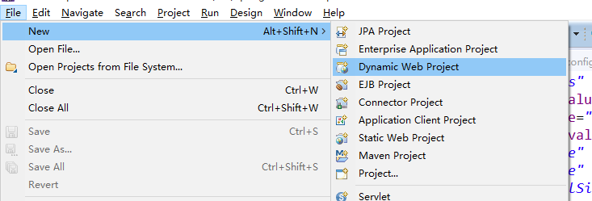
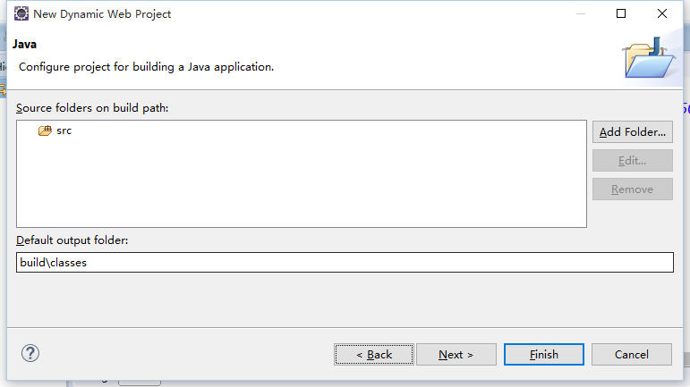

<h1>SSM框架整合搭建</h1>  

----------
Spring+SpringMVC+Mybatis是目前最流行的java web框架组合，简单的来说SpringMVC负责处理客户端和web的请求，然后给客户端返回数据， Spring则是负责管理事务对象，也就是作为不同层面的衔接，而MyBatis是个持久层框架，通过MyBatis开发者可以以对象的方式操作业务系统数据库。

## 准备工作
准备SSM框架所依赖的jar包

* Spring相关jar包：

spring-aop-4.3.1.RELEASE.jar

spring-beans-4.3.1.RELEASE.jar

spring-context-4.3.1.RELEASE.jar

spring-context-support-4.3.1.RELEASE.jar

spring-core-4.3.1.RELEASE.jar

spring-expression-4.3.1.RELEASE.jar

spring-jdbc-4.3.1.RELEASE.jar

spring-test-4.3.1.RELEASE.jar

spring-tx-4.3.1.RELEASE.jar

spring-web-4.3.1.RELEASE.jar

spring-webmvc-4.3.1.RELEASE.jar

* MyBatis相关jar包：

mybatis-3.3.0.jar

mybatis-spring-1.2.2.jar

* 数据库驱动jar包(根据具体数据库选择)：

mysql-connecter-java-5.1.39.jar/postgresql-9.1-901.jdbc4.jar

* 日志相关jar包：

log4j-1.2.16.jar

slf4j-log4j12-1.6.2.jar

slf4j-api-1.6.2.jar

* 映射json：

jackson-mapper-asl-1.9.13.jar

* 编码相关jar包:

commons-codec-1.4.jar

* IO处理相关jar包：

commons-io-2.0.1.jar

## IDE及JDK要求

使用eclipse、MyEclipse、IntelliJ IDEA均可；本教程使用的IDE为eclipse JAVA EE 4.6.0；

JDK版本要求1.7（不得使用1.8）。

## 搭建整合

### 第一步，新建Web工程

使用Eclipse新建“Dynamic Web Projcet”：



在弹出的窗口中填写项目名称，然后点击“Next”：


继续点击“Next”：



在这一步的窗口，勾选“Generate web.xml deployment descriptor”，然后点击Finish就创建完成啦


### 第二步：引入准备好的jar包
在WebContent/WEB-INF/lib目录下，把之前准备好的jar包都引入进来：


### 第三步：配置jdbc.properties文件
在src根目录下建立“jdbc. properties”配置文件，此文件用来配置工程要连接的数据库基本信息参数


内容示例：

```xml
driver=org.postgresql.Driver
url=jdbc:postgresql://192.168.160.167:5432/addrlist
username=addrlist
password=FHuma025
#定义初始连接数  
initialSize=1
#定义最大连接数  
maxActive=20
#定义最大空闲  
maxIdle=20
#定义最小空闲  
minIdle=1
#定义最长等待时间  
maxWait=60000
```

### 第四步，配置spring-db.xml文件
在src目录下建立spring-db.xml文件，此文件用来完成Spring和Mybatis的整合。主要的就是自动扫描，自动注入，配置数据库。

```xml
<?xml version="1.0" encoding="UTF-8"?>
<beans xmlns="http://www.springframework.org/schema/beans"
	xmlns:xsi="http://www.w3.org/2001/XMLSchema-instance" xmlns:mvc="http://www.springframework.org/schema/mvc"
	xmlns:context="http://www.springframework.org/schema/context"
	xsi:schemaLocation="http://www.springframework.org/schema/mvc http://www.springframework.org/schema/mvc/spring-mvc.xsd
		http://www.springframework.org/schema/beans http://www.springframework.org/schema/beans/spring-beans.xsd
		http://www.springframework.org/schema/context http://www.springframework.org/schema/context/spring-context.xsd">
<!-- 引入jdbc配置文件 -->
<bean id="propertyConfigurer"
	class="org.springframework.beans.factory.config.PropertyPlaceholderConfigurer">
	<property name="location" value="classpath:jdbc.properties" />
</bean>

<!-- spring和MyBatis完美整合，不需要mybatis的配置映射文件 -->  
<bean id="sqlSessionFactory" class="org.mybatis.spring.SqlSessionFactoryBean">  
    <property name="dataSource" ref="dataSource" />  
    <!-- 自动扫描mapping.xml文件 -->  
    <property name="mapperLocations" value="classpath:com/fh/demo/mapping/*.xml"></property>  
</bean>  

<!-- DAO接口所在包名，Spring会自动查找其下的类 -->  
 <bean class="org.mybatis.spring.mapper.MapperScannerConfigurer">  
     <property name="basePackage" value="com.fh.demo.dao" />  
     <property name="sqlSessionFactoryBeanName" value="sqlSessionFactory"></property>  
 </bean>  

 <!-- (事务管理)transaction manager, use JtaTransactionManager for global tx -->  
 <bean id="transactionManager"  
     class="org.springframework.jdbc.datasource.DataSourceTransactionManager">  
     <property name="dataSource" ref="dataSource" />  
 </bean>  

<!-- 配置DataSource数据源 -->
<bean id="dataSource" class="com.mchange.v2.c3p0.ComboPooledDataSource">
	<property name="driverClass" value="${driver}" />
	<property name="jdbcUrl" value="${url}" />
	<property name="user" value="${username}" />
	<property name="password" value="${password}" />
	<property name="minPoolSize" value="2" />
	<property name="maxPoolSize" value="20" />
	<property name="initialPoolSize" value="2" />
	<property name="preferredTestQuery">
		<value>select 1</value>
	</property>
	<property name="checkoutTimeout">
		<value>3000</value>
	</property>
	<property name="idleConnectionTestPeriod">
		<value>60</value>
	</property>
	<property name="maxIdleTime">
		<value>120</value>
	</property>
	<property name="dataSourceName">
		<value>addrlist</value>
	</property>
</bean>
<!-- 配置DataSource数据源 -->
<bean id="dataSource2" class="com.mchange.v2.c3p0.ComboPooledDataSource">
	<property name="driverClass" value="${driver}" />
	<property name="jdbcUrl" value="jdbc:postgresql://192.168.160.167:5432/pushtestdb" />
	<property name="user" value="${username}" />
	<property name="password" value="${password}" />
	<property name="minPoolSize" value="2" />
	<property name="maxPoolSize" value="20" />
	<property name="initialPoolSize" value="2" />
	<property name="preferredTestQuery">
		<value>select 1</value>
	</property>
	<property name="checkoutTimeout">
		<value>3000</value>
	</property>
	<property name="idleConnectionTestPeriod">
		<value>60</value>
	</property>
	<property name="maxIdleTime">
		<value>120</value>
	</property>
	<property name="dataSourceName">
		<value>pushtestdb</value>
	</property>
</bean>
</beans>  
```