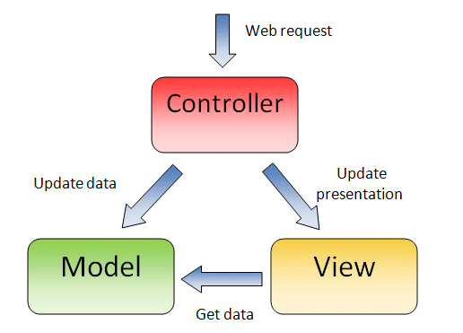
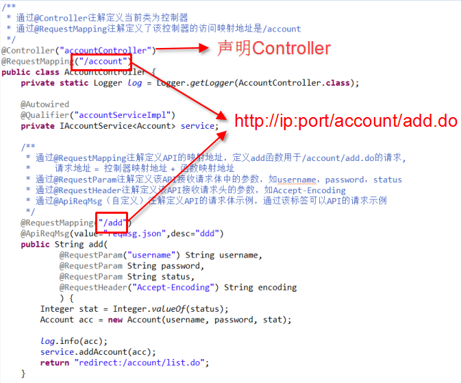

<h1>服务推荐技术手段</h1>  

----------
## 开发技术
利用ExMobi平台开发应用，首先需要具备如下知识和技能：

1. 精通XPATH
2. 熟练使用Tomcat，熟练使用Eclipse、Myeclipse、intellij idea等java开发常用IDE
3. 熟悉Ethereal抓包工具，Firebug或其它浏览器开发人员插件
4. 熟悉正则表达式
5. 熟悉网页相关的HTML、CSS、JS技术
6. 掌握JAVA基础
7. 熟悉MVC开发框架，熟悉SpringMVC及注解方式开发

## SpringMVC
ExMobi服务端对基于SpringMVC开发的服务，增加了一系列特有的功能，如API定义自动抽取和界面展示、API界面调试和访问控制API拦截器实现等，因此ExMobi服务端推荐开发者使用SpringMVC开发服务。

一直习惯于使用Spring + Struts2作为web开发MVC框架的软件工程师，长期饱受Struts2频繁爆出各种安全漏洞的问题，了解SpringMVC的架构后，多半会选择放弃Struts2，投入SpringMVC的怀抱。

SpringMVC是一个基于DispatcherServlet的MVC框架，每一个请求最先访问的都是DispatcherServlet，DispatcherServlet基于RequestMapping声明转发每一个Request请求给相应的控制器（Controller），Controller处理以后再返回相应的视图(View)和模型(Model)，返回的视图和模型都可以不指定，即可以只返回Model或只返回View或都不返回。SpringMVC支持使用注解定义控制层组件、业务层组件、数据访问组件和请求映射，让开发时候省了大量繁琐的配置工作，让开发者集中经历处理具体业务。

SpringMVC用于移动应用后端的开发，开发者仅需用@Controller声明一个控制器类，用@RequestMapping声明请求地址，即可定义一个后端API。

## 其他
ExMobi服务遵循JAVAEE标准WEB的目录结构并以war包形式上传到平台中，因此可以支持各种框架和技术手段实现的服务端程序，如传统的Spring + Struts2 + Hibernate、Spring + Struts2 + Ibatis，不过ExMobi服务端更推荐使用Spring + SpringMVC + exmobi-*.jar实现。